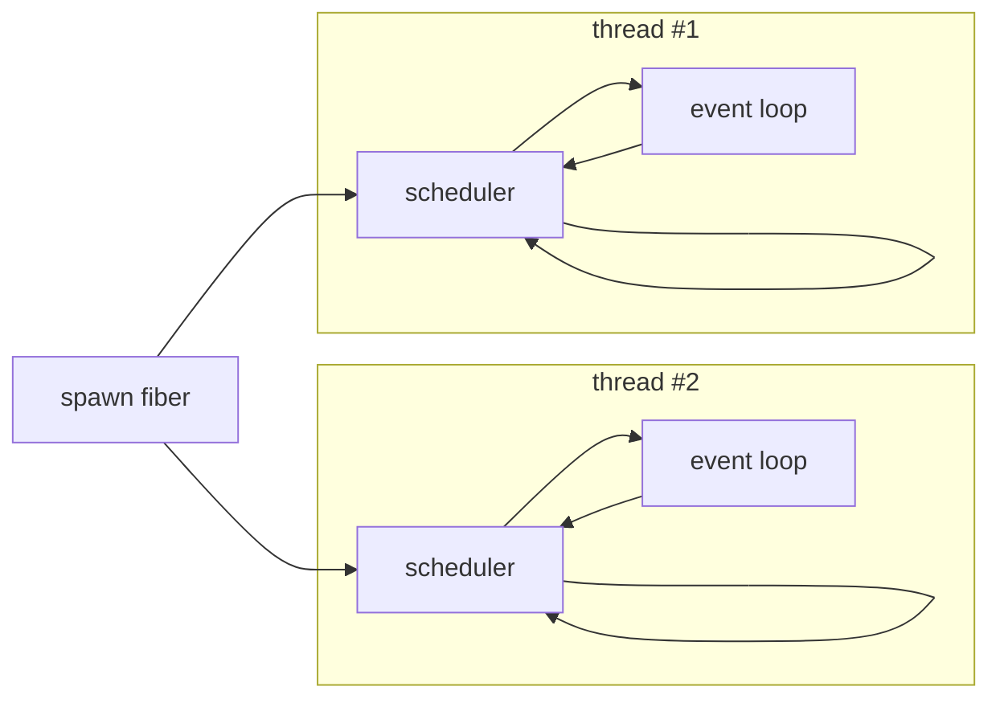
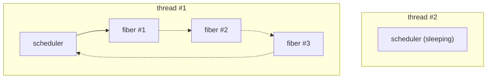

# Summary

Reinvent MT support in Crystal to be more efficient, for example by avoiding blocked fibers while there are sleeping threads, all the while empowering developers with different Execution Contexts to run fibers in.

Note: this proposal takes inspiration from Go and Kotlin.

# Motivation (analysis of current situation)

## Terminology

- **Thread**: program whose execution is controlled by the operating system ([wikipedia](https://en.wikipedia.org/wiki/Thread_(computing))).
- **Fiber**: unit of works or “functions whose execution you can pause” ([wikipedia](https://en.wikipedia.org/wiki/Coroutine)), we can run multiple fibers per thread.
- **Scheduler**: manages fibers’ executions inside the program (controlled by Crystal), unlike threads that are scheduled by the operating system (outside of the accessibility of the program).
- **Event Loop**: an abstraction to wait on specific events, such as timers (e.g. wait until a certain amount of time has passed) or IO (e.g. wait for an socket to be readable or writable).
- **Multi-threaded (MT)**: the environment uses multiple threads, fibers can run both concurrently and in parallel on different CPU cores.
- **Single-threaded (ST)**: the environment uses only one thread, fibers can never run in parallel but still run concurrently.

## Concurrency

> [!NOTE]
> I only quickly sum up the concurrency model. There are very interesting topics about concurrency to consider (e.g. structured concurrency, fiber cancellation), but this RFC focuses on parallelism.

Fibers, also commonly named coroutines, lightweight- or user-threads, are the basis of the concurrency system in Crystal.

Fibers are designed around blocks. The runtime of the fiber is the code executed within that block. Fibers do not return any value, unlike other coroutine systems like in Kotlin for example.

Whenever an operation would block, only the currently running Fiber will be blocked. It will be resumed later when the operation can execute without blocking (or result in an error). While a fiber is suspended, another fiber will be running. If no other fibers are running then the runtime waits for the event-loop to report that we can resume this or that fiber.

For example IO operations, such as opening a file or reading from a socket, are really non-blocking as per the operating system and Crystal’s standard library, but for the developer it appears as blocking.

Fibers are cooperative and can’t be preempted from external means. That being said the thread itself running fibers may be preempted by the operating system, also blocking all pending fibers schedulers on that thread.

The fact that fibers can’t be preempted is a side effect, and not part of the concurrency model. A future evolution may actively preempt fibers that have been running for too long, or ask them to yield at preemptible points.

## Parallelism

The current MT model can be summed up in one sentence:

> [!IMPORTANT]
> A fiber will always be resumed by the same thread.

Spawning a fiber will send it to any running thread (in a round robin-ish way) to try and spread new fibers across different threads. A spawned fiber can optionally be associated to the same thread as the current fiber, hence grouping some fibers together, eventually forming a list of fibers that can run concurrently but will never run in parallel of each others.

In technical details the current MT solution also means:

1. Threads and schedulers are glued together. Each thread has a scheduler and a scheduler belongs to a dedicated thread. Fibers are tied to a thread (maybe they should be tied to a scheduler, fibers don’t care much about the thread, except for enqueuing).
2. Each thread/scheduler has its own dedicated event loop to wait for events.
3. A scheduler will handle its queue and immediately go to sleep whenever the queue is empty (waiting for events on the event loop).
4. We can’t target a specific thread or scheduler when spawning a fiber: it’s either sent to a thread (including the current one) or to the current thread.

Basically, the words scheduler and thread are almost interchangeable in the current MT model.



## Pros

If all fibers on one thread operate on the same data, that data should already be available in the CPU caches.

### Data locality

With few fibers running, resuming may improve cache reuses, which can improve performance. With too many threads (than available CPUs) or a busy operating system with many apps, with lots of thread context switches, that may not hold true.

### Group a set of fibers together

Such a group of fibers will never run in parallel. This can vastly simplify the synchronization logic since you don’t have to deal with parallelism anymore, only concurrency, which is much easier & faster to deal with. For example no need for costly atomic operations, you can simply access a value directly. Parallelism issues and their impact on the application performance is limited to the global communication.

## Issues

### The round robin dispatcher doesn’t consider busy threads.

Crystal pushes new fibers to whatever thread, meaning that we may push fibers to busy threads with a large queue, while there may be available threads, or with smaller / faster queues.

If you’re unlucky, the busy fibers can be scheduled on the same thread while another thread is sleeping, impacting the performance instead of improving it, as we don’t benefit from parallelism.

### A starving thread will go to sleep

A thread whose scheduler queue of runnable fibers runs empty will immediately put itself to sleep, regardless of how busy other threads may be. An application performance may be impacted as it can lose one or more CPUs that will only be resumed when new fibers are queued, while fibers will continue to be queued on the busy thread(s).

### CPU bound fiber blocks other fibers queued on the same thread/scheduler

See issue [#12392](https://github.com/crystal-lang/crystal/issues/12392) for an example of this problem: a CPU bound fiber that never encounters a preemptible point will block all the fibers that are stuck on the thread, without any possibility for them to be moved to another thread.

The worst case is stalling the whole application waiting for one fiber, as well as having the busy fibers stuck on some threads, instead of being spread across all the threads, limiting or preventing parallelism.

### Example

In the following graphic we can see that thread #1 is busy (running fiber 1, with fibers 2 and 3 being blocked), while thread #2 is sleeping.



## Limitations

> [!IMPORTANT]
> Some of these limitations may be fixable in the current model, with maybe a few limitations left.

### Can’t control the number of threads/schedulers at runtime

There is no API to determine the initial number of threads/schedulers, or to resize the list.

> [!NOTE]
> This could be fixed with the current model. Sizing up isn’t an issue, but sizing down can be: we can’t move fibers, so we must wait for the queue to run empty before the thread can stop. If long running fibers are sent to different threads (e.g. signal handler loop, loggers) we may not be able to resize down!

### Can’t start a thread without a scheduler & event-loop

Technically we can (`Thread.new` is undisclosed API but can be called), yet calling anything remotely related to fibers or the event-loop is dangerous as it will immediately create a scheduler for the thread, and/or an event-loop for that thread, and possibly block the thread from doing any progress if the thread puts itself to sleep waiting for an event, or other issues.

> [!NOTE]
> We can fix this in the current model. For example by supporting to create a “bare” thread. Spawning a fiber would always be sent to other schedulers (or raise). We can also probably figure something about the event-loop and timers (e.g. Thread.sleep).

### Can’t isolate a fiber to a thread

The fiber becomes the sole fiber executing on that thread, for a period of time or forever. No fiber shall be scheduled on that thread anymore. Here are some use cases:

- Run the Gtk or QT main loops, that must run in a dedicated thread, callbacks from the UI may run in that thread and communicate with the rest of the Crystal application, even if it only has one other thread for running all fibers, the communication must be thread safe.
- Executing a slow, CPU-bound, operation can take a while (e.g. calculating a bcrypt password hash) and it will block all progress of other fibers that happen to run on the same thread.
- Again, see issue [#12392](https://github.com/crystal-lang/crystal/issues/12392).

> [!NOTE]
> We could workaround this in the current model. For example by supporting to create a thread without a scheduler and execute some action there. It would work nicely for very long operations (maybe not so with operations that may last for some hundred milliseconds).
>
> That wouldn’t fix issue [#12392](https://github.com/crystal-lang/crystal/issues/12392) however: we can’t have the current thread continue running the current fiber, and actively move the scheduler to another thread to not block the other fibers, otherwise the fibers would run in parallel to the isolated fiber, breaking the contract!

# Guide-level explanation (the proposal)

In the light of the pros (locality) and cons (blocked fibers), I propose to break the "a fiber will always be resumed by the same thread" concept and instead have "a fiber may be resumed by any thread" to enable more scenarios, for example a MT environment with work stealing.

These scenarios don't have to be a single MT environment with work stealing like Go proposes, but instead to have the ability, at runtime, to create environments to spawn specific fibers in.

## Execution contexts

An execution context creates and manages a dedicated pool of 1 or more threads where fibers can be executed into. Each context manages the rules to run, suspend and swap fibers internally.

Applications can create any number of execution contexts in parallel. These contexts are isolated but they shall still be capable to communicate together with the usual synchronization primitives (e.g. Channel, Mutex) that must be thread-safe.

Said differently: an execution context groups fibers together. Instead of associating a fiber to a specific thread, we'd now associate a fiber to an execution context, abstracting which thread(s) they actually run on.

When spawning a fiber, the fiber would by default be enqueued into the current execution context, the one running the current fiber. Child fibers will then execute in the same execution context as their parent (unless told otherwise).

Once spawned a fiber shouldn’t _move_ to another execution context. For example on re-enqueue the fiber must be resumed into it’s execution context: a fiber running in context B enqueues a waiting sender from context A must enqueue it into context A. That being said, we could allow to _send_ a fiber to another context.

## Kinds of execution contexts

The following are the potential contexts that Crystal could implement in stdlib.

**Single Threaded Context**: fibers will never run in parallel, they can use simpler and faster synchronization primitives internally (no atomics, no thread safety) and still communicate with other contexts with the default thread-safe primitives; the drawback is that a blocking fiber will block the thread and all the other fibers.

**Multi Threaded Context**: fibers will run in parallel and may be resumed by any thread, the number of schedulers and threads can grow or shrink, schedulers may move to another thread (M:N schedulers:threads) and steal fibers from each others; the advantage is that fibers that can run should be able to run, as long as a thread is available (i.e. no more starving threads) and we can be shrink the number of schedulers;

**Isolated Context**: only one fiber is allowed to run on a dedicated thread (e.g. `Gtk.main`, game loop, CPU heavy computation), thus disabling concurrency on that thread; the event-loop would work normally (blocking the current fiber, hence the thread), trying to spawn a fiber without an explicit context would spawn into another context specified when creating the isolated context that could default to `Fiber::ExecutionContext.default`.

Precisions:

- The above list isn’t exclusive: there can be other contexts with different rules (for example MT without work stealing).
- Each context isn’t exclusive: an application can start as many contexts in parallel as it needs.
- An execution context should be wrappable. For example we could want to add nursery-like capabilities on top of an existing context, where the EC monitors all fibers and automatically shuts down when all said fibers have completed.

## The default execution context

Crystal starts a MT execution context with work-stealing where fibers are spawned by default. The goal of this context is to provide an environment that should fit most use cases to freely take advantage of multiple CPU cores, without developers having to think much about it, outside of protecting concurrent accesses to a resource or, preferably, using channels to communicate.

It might be configured to run on one thread, hence disabling the parallelism of the default context when needed. Yet, it might still run in parallel with other contexts!

**Note**: until Crystal 2.x the default execution context might be ST by default, to avoid breaking changes, and a compilation flag be required to choose MT by default (e.g. `-Dmt`).

## The additional execution contexts

Applications can create other execution contexts in addition to the default one. These contexts can have different behaviors. For example a context may make sure some fibers will never run in parallel or will have dedicated resources to run in (never blocking certain fibers). Even allow to tweak the threads' priority and CPU affinity for better allocations on CPU cores.

Ideally, anybody could implement an execution context that suits their application, or wrap an existing execution context.

## Examples

1. We can have fully isolated single-threaded execution contexts, mimicking the current MT implementation.

2. We can create an execution context dedicated to handle the UI or game loop of an application, and keep the threads of the default context to handle calculations or requests, never impacting the responsiveness of the UI.

3. We can create an MT execution context for CPU heavy algorithms, that would block the current thread (e.g. hashing passwords using BCrypt with a high cost), and let the operating system preempt the threads, so the default context running a webapp backend won't be blocked when thousands of users try to login at the same time.

4. The crystal compiler doesn’t need MT during the parsing and semantic phases (for now); we could configure the default execution context to 1 thread only, then start another execution context for codegen with as many threads as CPUs, and spawn that many fibers into this context.

5. Different contexts could have different priorities and affinities, to allow the operating system to allocate threads more efficiently in heterogenous computing architectures (e.g. ARM big.LITTLE).

# Reference-level explanation

An execution context shall provide:

- configuration (e.g. number of threads, …);
- methods to spawn, enqueue, yield and reschedule fibers within its premises;
- a scheduler to run the fibers (or many schedulers for a MT context);
- an event loop (IO & timers):

  => this might be complex: I don’t think we can share a libevent across event bases? we already need to have a “thread local” libevent object for IO objects as well as for PCRE2 (though this is an optimization).

  => we might want to move to our own primitives on top of epoll (Linux) and kqueue (BSDs) since we already wrap IOCP (Win32) and a PR for `io_uring` (Linux) so we don’t have to stick to libevent2 limitations (e.g. we may be able to allocate events on the stack since we always suspend the fiber).

Ideally developers would be able to create custom execution contexts. That means we must have public APIs for at least the EventLoop and maybe the Scheduler (at least its resume method), which sounds like a good idea.

In addition, synchronization primitives, such as `Channel(T)` or `Mutex`, must allow communication and synchronization across execution contexts, and thus be thread-safe.

## Changes

```crystal
class Thread
  # reference to the current execution context
  property! execution_context : Fiber::ExecutionContext

  # reference to the current MT scheduler (only present for MT contexts)
  property! execution_context_scheduler : Fiber::ExecutionContext::Scheduler

  # reference to the currently running fiber (simpler access + support scenarios
  # where a whole scheduler is moved to another thread when a fiber has blocked
  # for too long: the fiber would still need to access `Fiber.current`).
  property! current_fiber : Fiber
end

class Fiber
  def self.current : Fiber
    Thread.current.current_fiber
  end

  def self.yield : Nil
    ::sleep(0.seconds)
  end

  property execution_context : Fiber::ExecutionContext

  def initialize(@name : String?, @execution_context : Fiber::ExecutionContext)
  end

  def enqueue : Nil
    @execution_context.enqueue(self)
  end

  @[Deprecated("Use Fiber#enqueue instead")]
  def resume : Nil
    # can't call Fiber::ExecutionContext#resume directly (it's protected)
    Fiber::ExecutionContext.resume(self)
  end
end

def spawn(*, name : String?, execution_context : Fiber::ExecutionContext = Fiber::ExecutionContext.current, &block) : Fiber
  Fiber.new(name, execution_context, &block)
end

def sleep : Nil
  Fiber::ExecutionContext.reschedule
end

def sleep(time : Time::Span) : Nil
  Fiber.current.resume_event.add(time)
  Fiber::ExecutionContext.reschedule
end
```

And the proposed API. There are two distinct modules that each handle a specific
parts:

1. `Fiber::ExecutionContext` is the module aiming to implement the public facing API,
   for context creation and cross context communication; there can only be one
   instance object of an execution context at a time.

2. `Fiber::ExecutionContext::Scheduler` is the module aiming to implement internal API
   for each scheduler; there should be one scheduler per thread, and there may
   be one or more schedulers at a time for a single execution context (e.g. MT).

There is some overlap between each module, especially around spawning and
enqueueing fibers, but the context they're expected to run differ: while the
former need thread safe methods (i.e. cross context enqueues), the latter can
assume thread local safety.

```crystal
module Fiber::ExecutionContext
  # the default execution context (always started)
  class_getter default = MultiThreaded.new("DEFAULT", size: System.cpu_count.to_i)

  def self.current : ExecutionContext
    Thread.current.execution_context
  end

  # the following methods delegate to the current execution context, they expose
  # the otherwise protected instance methods which are only safe to call on the
  # current execution context:

  # Suspends the current fiber and resumes the next runnable fiber.
  def self.reschedule : Nil
    Scheduler.current.reschedule
  end

  # Resumes `fiber` in the execution context. Raises if the fiber
  # doesn't belong to the context.
  def self.resume(fiber : Fiber) : Nil
    if fiber.execution_context == current
      Scheduler.current.resume(fiber)
    else
      raise RuntimeError.new
    end
  end

  # the following methods can be called from whatever context and must be thread
  # safe (even ST):

  abstract def spawn(name : String?, &block) : Fiber
  abstract def spawn(name : String?, same_thread : Bool, &block) : Fiber
  abstract def enqueue(fiber : Fiber) : Nil

  # the following accessors don’t have to be protected, but their implementation
  # must be thread safe (even ST):

  abstract def stack_pool : Fiber::StackPool
  abstract def event_loop : Crystal::EventLoop
end

module Fiber::ExecutionContext::Scheduler
  def self.current : ExecutionContext
    Thread.current.execution_context_scheduler
  end

  abstract def thread : Thread
  abstract def execution_context : ExecutionContext

  # the following methods are expected to only be called from the current
  # execution context scheduler (aka current thread):

  abstract def spawn(name : String?, &block) : Fiber
  abstract def spawn(name : String?, same_thread : Bool, &block) : Fiber
  abstract def enqueue(fiber : Fiber) : Nil

  # the following methods must only be called on the current execution context
  # scheduler, otherwise we could resume or suspend a fiber on whatever context:

  protected abstract def reschedule : Nil
  protected abstract def resume(fiber : Fiber) : Nil

  # General wrapper of fiber context switch that takes care of the gc rwlock,
  # releasing the stack of dead fibers safely, ...
  protected def swapcontext(fiber : Fiber) : Nil
  end
end
```

Then we can implement a number of default execution contexts. For example a
single threaded context might implement both modules as a single type, taking
advantage of only having to deal with a single thread. For example:

```crystal
class SingleThreaded
  include Fiber::ExecutionContext
  include Fiber::ExecutionContext::Scheduler

  def initialize(name : String)
    # todo: start one thread
  end

  # todo: implement abstract methods
end
```

A multithreaded context should implement both modules as different types, since
there will be only one execution context but many threads that will each need a
scheduler. For example:

```crystal
  class MultiThreaded
    include Fiber::ExecutionContext

    class Scheduler
      include Fiber::ExecutionContext::Scheduler

      # todo: implement abstract methods
    end

    getter name : String

    def initialize(name : String, @size : Int32)
      # todo: start @size threads
    end

    def spawn(name : String?, same_thread : Bool, &block) : Fiber
      raise RuntimeError.new if same_thread
      self.spawn(name, &block)
    end

    # todo: implement abstract methods
  end
```

Finally, an isolated context could extend the singlethreaded context, taking
advantage of its —in practice we might want to have a distinct implementation
since we should only have to deal with two fibers (one isolate + one main loop
for its event loop).

```crystal
class Isolated < SingleThreaded
  def initialize(name : String, @spawn_context = Fiber::ExecutionContext.default, &@func : ->)
    super name
    @fiber = Fiber.new(name: name, &@func)
    enqueue @fiber
  end

  def spawn(name : String?, &block) : Fiber
    @spawn_context.spawn(name, &block)
  end

  def spawn(name : String?, same_thread : Bool, &block) : Fiber
    raise RuntimeError.new if same_thread
    @spawn_context.spawn(name, &block)
  end

  # todo: prevent enqueue/resume of anything but @fiber
end
```

### Example

```crystal
# (main fiber runs in the default context)
# shrink the main context to a single thread:
Fiber::ExecutionContext.default.resize(maximum: 1)

# create a dedicated context with N threads:
ncpu = System.cpu_count
codegen = Fiber::ExecutionContext::MultiThreaded.new(name: "CODEGEN", minimum: ncpu, maximum: ncpu)
channel = Channel(CompilationUnit).new(ncpu * 2)
group = WaitGroup.new(ncpu)

spawn do
  # (runs in the default context)
  units.each do |unit|
    channel.send(unit)
  end
end

ncpu.times do
  codegen.spawn do
    # (runs in the codegen context)
    while unit = channel.receive?
      unit.compile
    end
  ensure
    group.done
  end
end

group.wait
```

## Breaking changes

The default execution context moving from 'a fiber is always resumed on the same thread" to the more lenient 'a fiber can be resumed by any thread", this introduces a couple breaking changes over `preview_mt`.

1. Drop the "one fiber will always be resumed on the same thread" assumption, instead:
   - limit the default context to a single thread (disabling parallelism in the default context);
   - or start an additional, single threaded, execution context.

2. Drop the `same_thread` option on `spawn`, instead:
   - limit the default context to a single thread (disables parallelism in the default context);
   - or create a single-threaded execution context for the fibers that must live on the same thread.

3. Drop the `preview_mt` flag and make execution contexts the only compilation mode (at worst introduce `without_mt`):
   - one can limit the default context to a single thread to (disabling parallelism at runtime);
   - sync primitives must be thread-safe, because fibers running on different threads or in different execution contexts will need to communicate safely;
   - sync primitives must be optimized for best possible performance when there is no parallelism;
   - community maintained shards may propose alternative sync primitives when we don’t want thread-safety to squeeze some extra performance inside a single-threaded context.

4. The `Fiber#resume` public method is deprecated because a fiber can't be resumed into any execution context:
   - shall we raise if its context isn't the current one?
   - shall we enqueue into the other context and reschedule? that would change the behavior: the fiber is supposed to be resumed _now_, not later, and the current fiber could be resumed before it (oops);
   - the feature is also not used in the whole stdlib, and only appears within a single spec;
   - raising might be acceptable, and the deprecation be removed if someone can prove that explicit continuations are interesting in Crystal.

> [!NOTE]
> The breaking changes can be postponed to Crystal 2 by making the default execution context be ST, keep supporting `same_thread: true` for ST while MT would raise, and `same_thread: false` would be a NOOP. A compilation flag can be introduced to change the default context to be MT in Crystal 1 (e.g. keep `-Dpreview_mt` but consider just `-Dmt`). Crystal 2 would drop the `same_thread` argument, make the default context MT:N, and introduce a `-Dwithout_mt` compilation flag to return to ST to ease the transition.
>
> Alternatively, since the `-Dpreview_mt` compilation flag denotes an experimental feature, we could deprecate `same_thread` in a Crystal 1.x release, then make it a NOOP and set the default context to MT:1 in a further Crystal 1.y release. Crystal 2 would then drop the `same_thread` argument and change the default context to MT:N.

# Drawbacks

Usages of the `Crystal::ThreadLocalValue` helper class might break with fibers moving across threads. We use this because the GC can't access the Thread Local Storage space of threads. Some usages might be replaceable with direct accessors on `Thread.current` but some usages link a particular object instance to a particular thread; those cases will need to be refactored.

- `Reference` (`#exec_recursive` and `#exec_recursive_clone`): a fiber may be preempted and moved to another thread while detecting recursion (should be a fiber property?)...

> [!CAUTION]
> This might actually be a bug even with ST: the thread could switch to another fiber while checking for recursion. I assume current usages are cpu-bound and never reach a preemptible point, but still, there are no guarantees.

- `Regex` (PCRE2): not affected (no fiber preemption within usages of JIT stack and match data objects);

- `IO::Evented`: will need an overhaul depending on the event loop details (still one per thread? or one per context?);

> [!WARNING]
> The event loop will very likely need an interface to fully abstract OS specific details around nonblocking calls (epoll, kqueue, IOCP, io_uring, …). See [#10766](https://github.com/crystal-lang/crystal/issues/10766).

# Rationale and alternatives

The rationale is to have efficient parallelism to make the most out of the CPU cores, to provide an environment that should usually work, yet avoid limiting the choices for the developer to squeeze the last remaining drops of potential parallelism.

The most obvious alternative would be to keep the current MT model. Maybe we could fix a few shortcomings, for example shrink/resize, start a thread without a scheduler, allow fibers non explicitly marked as same thread to be moved across threads (though it might be hard to efficiently steal fibers), ...

Another alternative would be to implement Go's model and make it the only possible environment. This might not be the ideal scenario, since Crystal can't preempt a fiber (unlike Go) having specific threads might be a better solution to running CPU heavy computations without blocking anything (if possible).

One last, less obvious solution, could be to drop MT completely, and assume that crystal applications can only live on a single thread. That would heavily simplify synchronization primitives. Parallelism could be achieved with multiple processes and IPC (Inter Process Communication), allowing an application to be distributed inside a cluster.

# Prior art

As mentioned in the introduction, this proposal takes inspiration from Go and Kotlin ([coroutines guide](https://kotlinlang.org/docs/coroutines-guide.html)).

Both languages have coroutines and parallelism built right into the language. Both declare that coroutines may be resumed by whatever thread, and both runtimes expose an environment where multiple threads can resume the coroutines.

**Go** provides one execution context: their MT optimized solution. Every coroutine runs within that global context.

**Kotlin**, on the other hand, provides a similar environment to Go by default, but allows to [create additional execution contexts](https://kotlinlang.org/docs/coroutine-context-and-dispatchers.html) with one or more threads. Coroutines then live inside their designated context, which may each be ST or MT.

The **Tokio** crate for **Rust** provides a single-threaded scheduler or a multi-threaded scheduler (with work stealing), but it must be chosen at compilation time. Apparently the MT scheduler is selected by default (to be verified).

# Unresolved questions

## Introduction of the feature

The feature will likely require both the `preview_mt` and `execution_contexts` flags for the initial implementations.

~~Since it is a breaking change from stable Crystal, unrelated to `preview_mt`, MT and execution contexts may only become default with a Crystal major release?~~

~~Maybe MT could be limited to 1 thread by default, and `spawn(same_thread)` be deprecated, but what to do with `spawn(same_thread: true)`?~~

## Default context configuration

This proposal doesn’t solve the inherent problem of: how can applications configure the default context at runtime (e.g. number of MT schedulers) since we create the context before the application’s main can start. 

We could maybe have sensible defaults + lazily started schedulers & threads, which means that the default context would only start 1 thread to run 1 scheduler, then start up to `System.cpu_count` on demand (using some heuristic).

The application would then be able to scale the default context programmatically, for example to a minimum of 4 schedulers which will immediately start the additional schedulers & threads.

# Future possibilities

MT execution contexts could eventually have a dynamic number of threads, adding new threads to a context when it has enough work, and removing threads when threads are starving (always within min..max limits). Ideally the threads could return to a thread pool (up to a total limit, like GOMAXPROCS in Go) and be reused by other contexts.
