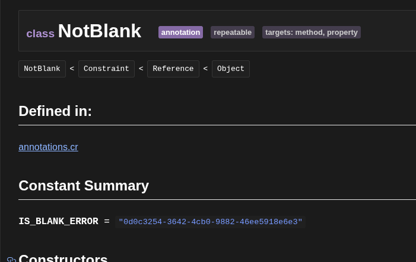

# Summary

Make annotations more flexible/structured by:

- Being able to define the fields an annotation expects/requires, their default values if any, and expected type with compile time validation
- Allowing inheriting annotations, both to share logic, and to provide more specialized version of an annotation
- Exposing a runtime representation of an annotation plus its data
- Provide a more flexible base for future improvements

# Motivation

As someone who does a lot with annotation/macros, I've come to really be aware of their limitations and wishing for something a bit more robust than they currently are.

1. Annotations are pretty good in a macro context, but when you want to also expose the data within them at runtime, it gets a bit more complicated as there's no clean way to match annotations to corresponding runtime types.
The main use case for this is using annotations as a form of DSL to supply information, but using that information at runtime since there's only so much you can do at compile time.
2. Annotations basically act as named containers of positional/named arguments. Being able to more explicitly define what the expected arguments are, and their type would help prevent bugs.
3. I'd love to be able to inherit annotations to allow sharing the logic of a more generic parent annotation with a more specialized child annotation.

The expected outcome is to provide a new "version" or "type" of annotation that is much more flexible than before.
My primary use case for this is for a validation library where you can have an annotation like `NotBlank` that can be applied to ivars AND instantiated manually as needed.

# Guide-level explanation

## Type-based Annotations

Annotations can now be defined using a meta `@[Annotation]` annotation on a class or struct:

```crystal
abstract class Constraint
  getter message : String

  def initialize(@message : String); end
end

@[Annotation]
class NotBlank < Constraint
  getter? allow_nil : Bool

  def initialize(
    @allow_nil : Bool = false,
    message : String = "This value should not be blank.",
  )
    super message
  end
end
```

Working title for a class/struct with an `@[Annotation]` annotation is a "class-based annotation".
A compile time error will be raised if its applied to non class/structs (`module`, `lib`, ...).
These types can then be used as you would an annotation defined via the `annotation` keyword:

```crystal
class User
  @[NotBlank(allow_nil: true)]
  property name : String = "Jim"
end
```

The compiler validates arguments provided to the annotation based on the constructor(s) of the class-based annotation.
E.g. `@[NotBlank(allow_nil: "foo")]` or `@[NotBlank("foo")]` would result in a compile time error like `@[NotBlank] parameter 'allow_nil' expects Bool, not String` that is pointing at the invalid arg.
Class-based annotations's values may still be accessed at compile time, either via position or name.

Unlike existing annotations, accessing a value that wasn't explicitly provided will return the constructor parameter's default value if one exists.
For example, given `@[NotBlank]` with no arguments: `ann["allow_nil"]` returns `false` and `ann["message"]` returns `"This value should not be blank."`.
Positional access works the same way: `ann[0]` and `ann[1]` return the respective defaults.

Class-based annotations may be applied to any language construct that accepts annotations by default.
Unlike previous existing annotations however, class-based annotations may only applied once to the same item.
Applying the same annotation more than once will result in a compile time error.

## Metadata

One of the benefits of the `@[Annotation]` annotation, is it gives a place to add additional metadata to the annotation itself.
To start, it'll allow the following fields, but allows for future expansion:

- `repeatable` - When `true`, allows the annotation to be applied multiple times to the same item. Defaults to `false`.
- `targets` - An array of strings restricting which constructs this annotation can be applied to. Valid values: "class", "method", "property", "parameter". Defaults to allowing all targets.

## Inheritance

As you may have noticed earlier, class-based annotations may continue to inherit from other types.
The `@[Annotation]` annotation may _NOT_ be applied to `abstract` types.
If a child type inherits from a type that _is_ an annotation, the child type does _NOT_ automatically become an annotation; it must explicitly define `@[Annotation]` as well.

The `#annotations` method returns annotations matching the provided type.
The provided type doesn't have to be a class-based annotation itself; but instead could be an non-annotation abstract parent type, or even a module.
A new optional `is_a` parameter (default `false`) expands the search to include class-based annotations whose types inherit from or include the provided type.
This enables polymorphic annotation queries—for example, finding all `Constraint` subclass annotations with `@type.annotations(Constraint, is_a: true)`.

The `#annotation` method remains unchanged and _only_ accepts existing annotations, or a class-based annotation.

## Runtime Representation

Types that have `@[Annotation]` applied to them do not have any of their runtime behavior altered.
As such, it's still possible to manually instantiate them as you would a normal class/struct.
There is a new `#new_instance` annotation macro method that generates an instantiation of the class-based annotation at runtime, passing the named and positional arguments within the annotation to the type's `.new` constructor.

```crystal

  constraint = {{ ann.new_instance }}
  # constraint is now a NotBlank instance
  # same as if you did like `NotBlank.new(message: "My Custom Message")`

```

## Existing Annotations

The existing `annotation Foo; end` syntax remains for backwards compatibility.
However, if a struct/class is only ever used at compile time within macros, and never instantiated/referenced in runtime code, it would be optimized out. So there is minimal overhead in having it be defined via a runtime type.

As such, I'd expect a good portion of annotation usages will switch to the new `@[Annotation]` approach.

## Documentation

The API docs for types annotated with `@[Annotation]` include a badge to denote that type is an annotation.
There are also badges to denote the various metadata of the annotation.



# Reference-level explanation

There is a new `@[Annotation]` meta annotation that can be applied to a `class` or `struct`:

```crystal
@[Annotation]
class Foo; end

@[Annotation]
record Bar
```

## Compiler

Within the top level visitor we check if a type has this annotation, and if so, parse any metadata from it, then remove it from the list of annotations that type has.
A `ClassDef` is denoted to be an annotation via new `property? annotation : Bool = false` property.
Annotation metadata is stored as a new `property : AnnotationMetadata? = nil` instance on `ClassDef`.
This file is also where we reject applying a `@[Annotation]` to un-supported types (`module`, `lib`, ...).

A new `alias AnnotationKey = AnnotationType | ClassType` alias was added that `Annotatable` now uses to support class-based annotations.
The `add_annotation` has been updated to include a new optional `target` parameter that represents the target the annotation is being added to.
Class-based annotations's metadata is also validated here as it's central to all types that can be annotated.

Light validation happens in the semantic visitor by looking up the available constructors of the type and seeing if the related arg is compatible with any overload.
As of now it does _not_ fully validate things meaning if you have two separate overloads that require unique parameters for each, if you provide one annotation argument from each overload, it would be okay with that. It can handle runtime validation if you ever were to instantiate a runtime instance of that annotation however.

AST literal nodes (`NumberLiteral`, `StringLiteral`, etc.) gain `#runtime_type` to avoid having a big mapping within the visitor itself.

## Std Lib

The `#annotations` method on `TypeNode`, `Arg`, `MetaVar`, and `Def` gains a second, optional `is_a` parameter that defaults to `false`.

The `TypeNode` macro type gains:

- `#annotation?` - Returns a `BoolLiteral` if a type is either an existing annotation or a class-based annotation
- `#annotation_class?` - Returns a `BoolLiteral` if this type is a class-based annotation
- `#annotation_repeatable?` - Returns a `BoolLiteral` if this type is a class-based annotation and it can be applied multiple times
- `#annotation_targets` - Returns an `ArrayLiteral(StringLiteral)` of the targets this class-based annotation allows, or `nil` if not a class-based annotation/are not targets defined

The `Annotation` macro type gains:

- `#new_instance` - Returns AST for instantiating the annotation's runtime type with the provided arguments. Only valid for class-based annotations.

The doc generator's CSS/type template was updated to account for class-based annotations.

## Backward Compatibility

- Existing `annotation Foo; end` syntax is unchanged
- Existing annotation usage `@[Foo(...)]` syntax is unchanged
- Existing annotations would raise on `new_instance` because there is no `.new` method on non-class-based annotations.

# Drawbacks

- **Compiler complexity**: Additional code paths for handling class-based annotations alongside traditional annotations.
- **Learning curve**: Having two ways to define annotations (`annotation Foo end` vs `@[Annotation] class Foo`) may confuse newcomers who need to understand when to use each approach.

# Rationale and alternatives

## Why this design?

Overall this is the simpler approach:

- There is no new "type" that users have to learn, and we don't need to re-implement features of classes/structs onto a new "annotation" type
- Being able to use the same type to represent the annotation at runtime and compile time reduces the amount of types needed
- Being able to use either a class OR struct is nice depending on the use case at hand
- Is an opt-in feature so is backwards compatible
- Sets us up well for additional future annotation features

## Alternatives considered

1. Using `annotation class Foo` or `annotation struct Foo` as a new keyword combination. This worked well, but doesn't provide a good extension point for future annotation metadata (targets, repeatability, etc).
2. Adding fields directly to `annotation Foo; end`. This looks good at first, but ultimately didn't work out too well. It locks you into `class`, have to generate a runtime type to use at runtime, and just has a lot of limitations/challenges that didn't make it feasible.

## Impact of not doing this

Annotations remain a compile time only construct, without validation, and users must continue using workarounds to expose data within them at runtime.

# Prior art

This implementation is heavily inspired by PHP 8's [attributes](https://php.watch/articles/php-attributes).
It's honestly very well designed and fits quite well into Crystal.

# Unresolved questions

- Nailing down the exact semantics, esp related to inheritance

# Future possibilities

- Ability to define a new `macro annotated` macro into a class-based annotation that is invoked when that annotation is applied, and would allow setting/mutating the args provided to the annotation
- More locations that annotation's could be used
